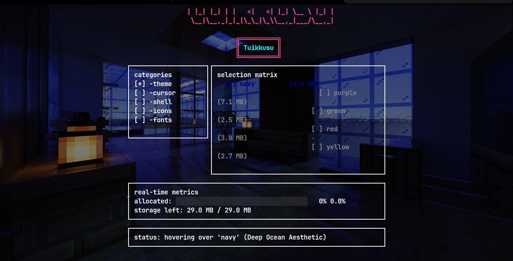

<div align="center">
  
</div>

<div align="center">
  
</div>

<p align="center">
  <strong>a TUI based management tool for storage size + tweaks selection >''<</strong>
</p>

---

## Prerequisites

To run Tuikkusu smoothly on your local machine, you will need:
- **Go (Golang)**: v1.21 or higher installed (to compile and run the engine). Download from [go.dev](https://go.dev/).
- **Node.js & npm/pnpm**: Required *only* if you want to run it dynamically via npx without cloning the repository.
- **Terminal**: A modern terminal emulator (e.g., iTerm2, Windows Terminal, Alacritty) with a bash/zsh shell to properly render the TUI graphics.

---

## Quick start

You can instantly launch the Tuikkusu TUI anywhere on your system using `npx` or `pnpm dlx`
### Using NPM:
```bash
npx github:KikiProjecto/tuikkusu
```

### Using PNPM:
```bash
pnpm dlx github:KikiProjecto/tuikkusu
```

### Native Go Install
if you prefer not to use Node.js at all, you can use Go's native package manager to install it directly to your system:
```bash
go install github.com/KikiProjecto/tuikkusu/tuikkusu@latest
tuikkusu
```

---

## How to Use

once the TUI boots up, you will navigate through the setup phases :
1. **Language Gate**: Use `Up/Down` or `k/j` to select English or Indonesia, then press `Enter`.
2. **Storage Gate**: Type your physical storage limit in MB (e.g. `500.0`) and press `Enter`.
3. **Customization Matrix**: 
   - Use Arrow Keys or `h/j/k/l` to browse options.
   - Press `Enter` to select an item and advance to the next category.
   - Press `Esc` or `s` to SKIP a category.
4. **Undo Rollback**: If you exceed your storage limit, you'll enter the Undo Panel. Press `Backspace` to pop the last item off your history stack until your storage returns to a safe threshold!

---

## Project Structure
```text
tuikkusu/
├── README.md
├── index.html
├── main.py
├── tuikkusu/         # Go-based TUI Engine
│   ├── go.mod
│   ├── go.sum
│   ├── main.go
│   └── tuikkusu      # Executable binary
└── visual/
    └── preview.png
```
