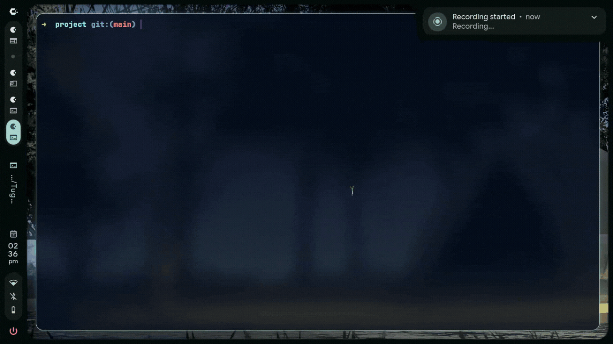

<div align="center">
  
</div>

<p align="center">
  <strong>it is a TUI based management tool for storage size + tweaks selection >''<</strong>
</p>

---
<div align="center">
  
</div>

---

## Prerequisites

To run tuikkusu smoothly on your local, you will need:
- **Go (Golang)**: v1.21 or higher installed (to compile and run the engine). Download from [go.dev](https://go.dev/).
- **Node.js & npm/pnpm**: Required *only* if you want to run it dynamically via npx without cloning the repository.
- **Terminal**: A modern terminal emulator (e.g., iTerm2, Windows Terminal, Alacritty) with a bash/zsh shell to properly render the TUI graphics.

---

## Quick start

You can instantly launch the Tuikkusu TUI anywhere on your system using `npx` or `pnpm dlx`
### Using NPM:
```bash
npx github:KikiProjecto/tuikkusu
```

### Using PNPM:
```bash
pnpm dlx github:KikiProjecto/tuikkusu
```

### Native Go Install
if you prefer not to use Node.js at all, you can use Go's native package manager to install it directly to your system:
```bash
go install github.com/KikiProjecto/tuikkusu/tuikkusu@latest
tuikkusu
```

---

## How to Use

once the TUI boots up, you will navigate through the setup phases :
1. **Language Gate**: Use `Up/Down` or `k/j` to select English or Indonesia, then press `Enter`.
2. **Storage Gate**: Type your physical storage limit in MB (e.g. `500.0`) and press `Enter`.
3. **Customization Matrix**: 
   - Use Arrow Keys or `h/j/k/l` to browse options.
   - Press `Enter` to select an item and advance to the next category.
   - Press `Esc` or `s` to SKIP a category.
4. **Undo Rollback**: If you exceed your storage limit, you'll enter the Undo Panel. Press `Backspace` to pop the last item off your history stack until your storage returns to a safe threshold!

---

## Project Structure
```text
tuikkusu/
├── README.md
├── index.html        # beta web (under work)
├── main.py           # program core source (college project '~')
├── app.py            # Flask web application
├── setup_db.sql      # MySQL database schema & access setup
├── tuikkusu/         # Go-based TUI Engine
│   ├── go.mod
│   ├── go.sum
│   ├── main.go
│   └── tuikkusu      # Executable binary
└── templates/
    └── index.html    # Flask web template
```

---

## Setup for desktop & flask web

### 1. Install Dependencies

Install it first :

```bash
sudo pacman -S tk
```

Then set up a virtual environment and install Python packages:

```bash
python -m venv env
source env/bin/activate
pip install flask mysql-connector-python
```

### 2. Setup Database

Make sure MySQL/MariaDB is running, then import the schema:

```bash
sudo mysql < setup_db.sql
```

This creates the `tweak_db` database, the `tb_pilihan` table, and the `tuikkusu` user with full privileges.

### 3. Run Desktop App (Tkinter GUI)

```bash
python main.py
```

The desktop app provides:
- **Entry**: Input storage capacity (MB)
- **Combobox**: Select tweak options per category
- **Treeview**: View records from `tb_pilihan` in real-time
- **Buttons**: Simpan (Create), Muat Data (Read), Hapus Pilihan (Delete by ID), Cek Total, Undo

### 4. Run Flask Web App

```bash
python app.py
```

Then open `http://localhost:5000` in your browser. The web version shares the same MySQL database (`tweak_db`) as the desktop GUI.

Routes:
- `/` - Main customization page with form and data table
- `/add` - Create new tweak record (POST)
- `/delete/<int:id>` - Delete record by ID

### 5. Environment Variables

The apps read database credentials from `.env`:

```env
DB_HOST=localhost
DB_USER=tuikkusu
DB_PASSWORD=tuikkusu123
DB_NAME=tweak_db
```
